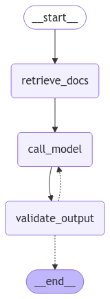

## Introduction

In this tutorial, you'll learn how to build an LLM-powered app that assists in writing SPARQL queries, step by step.

As we progress, you'll be provided with code snippets to gradually construct the system. Note that some earlier code may need to be modified or removed to prevent redundancy, ensuring a clean and efficient implementation.

---

## Outline

1. Programmatically query LLMs
2. Index documents
3. Use indexed documents as context
4. Add a web UI
5. Add SPARQL query validation
6. Optional: use an agent framework

---

## Setup

[Install `uv`](https://docs.astral.sh/uv/getting-started/installation/) to easily handle dependencies and run scripts.

If you use VSCode we recommend to have the [`Python` extension](https://marketplace.visualstudio.com/items?itemName=ms-python.python) installed.

Create a new folder, you will be using this same folder along the tutorial.

Create a `.env` file with the API key for the LLM provider you will use:

```sh
GROQ_API_KEY=gsk_YYY
OPENAI_API_KEY=sk-proj-YYY
```

> You can get a [free API key on groq.com](https://console.groq.com/keys) after login in with GitHub or Google. This gives you access to [various open-source models](https://groq.com/pricing/) with a limit of 6k tokens per minute.

---

## Setup dependencies

Create a `pyproject.toml` file with this content:

```toml
[project]
name = "tutorial-sparql-agent"
version = "0.0.1"
requires-python = "==3.12.*"
dependencies = [
    "sparql-llm >=0.0.8",
    "langchain >=0.3.19",
    "langchain-openai >=0.3.6",
    "langchain-groq >=0.2.4",
    "langchain-ollama >=0.2.3",
    "qdrant-client >=1.13.0",
    "fastembed >=0.5.1",
    "chainlit >=2.2.1",
]
```

---

## Programmatically query a LLM

Create a `app.py` file in the same folder

```python
from langchain_groq import ChatGroq

question = "What are the rat orthologs of human TP53?"

llm = ChatGroq(
    model_name="llama-3.3-70b-versatile",
    temperature=0,
)

resp = llm.invoke(question)
print(resp)
```

Run it with:

```sh
uv run --env-file .env app.py
```

---

## Stream a LLM response

```python
for msg in llm.stream(question):
    print(msg.content, end="")
```

---

## Easily switch the model used

```python
from langchain_core.language_models import BaseChatModel

def load_chat_model(model: str) -> BaseChatModel:
    provider, model_name = model.split("/", maxsplit=1)
    if provider == "groq":
        # https://python.langchain.com/docs/integrations/chat/groq/
        from langchain_groq import ChatGroq
        return ChatGroq(model_name=model_name, temperature=0)
    if provider == "openai":
        # https://python.langchain.com/docs/integrations/chat/openai/
        from langchain_openai import ChatOpenAI
        return ChatOpenAI(model_name=model_name, temperature=0)
    raise ValueError(f"Unknown provider: {provider}")

llm = load_chat_model("groq/llama-3.3-70b-versatile")
# llm = load_chat_model("openai/gpt-4o-mini")
```

> Alternatively you could replace LangChain by [LiteLLM](https://docs.litellm.ai/docs/) here

---

## Use a local LLM

Install ollama: [ollama.com/download](https://www.ollama.com/download)

Pull the [model](https://www.ollama.com/search) you want to use (⚠️ 4GB):

```sh
ollama pull mistral
```

Add the new provider:

```python
    if provider == "ollama":
        # https://python.langchain.com/docs/integrations/chat/ollama/
        from langchain_ollama import ChatOllama
        return ChatOllama(model=model_name, temperature=0)

llm = load_chat_model("ollama/mistral")
```

> Ollama is mainly a wrapper around [llama.cpp](https://python.langchain.com/docs/integrations/chat/llamacpp/), you can also [download `.gguf` files](https://huggingface.co/lmstudio-community/Mistral-7B-Instruct-v0.3-GGUF) and use them directly.

> [vLLM](https://github.com/vllm-project/vllm) and [llamafile](https://github.com/Mozilla-Ocho/llamafile) are other solutions to serve LLMs locally.

---

## Setup vector store

Deploy a **[Qdrant](https://qdrant.tech/documentation/)** vector store using [docker](https://hub.docker.com/r/qdrant/qdrant/tags) to store indexed documents:

```sh
docker run -d -p 6333:6333 -p 6334:6334 -v $(pwd)/data/qdrant:/qdrant/storage qdrant/qdrant
```

Or create a `compose.yml` file and start with `docker compose up -d`

```yml
services:
  vectordb:
    image: docker.io/qdrant/qdrant:v1.13.4
    ports:
      - "6333:6333"
      - "6334:6334"
    volumes:
      - ./data/qdrant:/qdrant/storage
    environment:
      - QDRANT__TELEMETRY_DISABLED=true
```

If you don't have docker you can try to [download and deploy the binary](https://github.com/qdrant/qdrant/releases/tag/v1.13.4) for your platform (this might require to install additional dependencies though)

> Using in-memory vector store is also an option, but limited to 1 thread, with high risk of conflicts and no dashboard.

---

## Index context

Create a new script that will be run to index data from SPARQL endpoints: `index.py`

```python
from sparql_llm import SparqlEndpointLinks

endpoints: list[SparqlEndpointLinks] = [
    {
        # The URL of the SPARQL endpoint from which most info will be extracted
        "endpoint_url": "https://sparql.uniprot.org/sparql/",
        # If VoID or query examples are not in the endpoint,
        # you can provide a VoID file (local or remote URL)
        "void_file": "data/uniprot_void.ttl",
        "examples_file": "data/uniprot_examples.ttl",
    },
    { "endpoint_url": "https://www.bgee.org/sparql/" },
    { "endpoint_url": "https://sparql.omabrowser.org/sparql/" },
]
```

> Replace the values by your own endpoints URLs, and previously generated files for the VoID description and examples if applicable.

---

## Index context

Use the loaders from **[sparql-llm](https://pypi.org/project/sparql-llm/)** to easily extract and load documents for queries examples and classes schemas in the endpoint:

```python
from langchain_core.documents import Document
from sparql_llm import SparqlExamplesLoader, SparqlVoidShapesLoader, SparqlInfoLoader

def index_endpoints():
    docs: list[Document] = []
    for endpoint in endpoints:
        print(f"\n  🔎 Getting metadata for {endpoint['endpoint_url']}")
        docs += SparqlExamplesLoader(
            endpoint["endpoint_url"],
            examples_file=endpoint.get("examples_file"),
        ).load()
        docs += SparqlVoidShapesLoader(
            endpoint["endpoint_url"],
            void_file=endpoint.get("void_file"),
            examples_file=endpoint.get("examples_file"),
        ).load()
    docs += SparqlInfoLoader(endpoints, source_iri="https://www.expasy.org/").load()
    print(f"✅ {len(docs)} documents indexed")
    print(docs[0])

if __name__ == "__main__":
    index_endpoints()
```

Run with:

```sh
uv run index.py
```

----

You could also provide the list of Document directly from your script

```python
ex_question = "How to retrieve proteins?"
docs.append(Document(
    page_content=ex_question,
    metadata={
        "question": ex_question,
        "answer": """SELECT ?protein WHERE {
	?protein a up:Protein .
}""",
        "endpoint_url": "https://sparql.uniprot.org/",
        "query_type": "SelectQuery",
        "doc_type": "SPARQL endpoints query examples",
    },
))
```

---

## Index context

Finally we can load these documents in the **[Qdrant](https://qdrant.tech/documentation/)** vector store.

We use **[FastEmbed](https://qdrant.github.io/fastembed/)** to generate embeddings locally with [open source embedding models](https://qdrant.github.io/fastembed/examples/Supported_Models/#supported-text-embedding-models).

```python
from fastembed import TextEmbedding
from qdrant_client import QdrantClient
from qdrant_client.http.models import Distance, VectorParams

embedding_model = TextEmbedding(
    "BAAI/bge-small-en-v1.5",
    # providers=["CUDAExecutionProvider"], # Replace the fastembed dependency with fastembed-gpu to use your GPUs
)
embedding_dimensions = 384
collection_name = "sparql-docs"
vectordb = QdrantClient(
    host="localhost",
    prefer_grpc=True,
    # location=":memory:", # if not using Qdrant as a service
)
def index_endpoints():
    # [...]
    if vectordb.collection_exists(collection_name):
        vectordb.delete_collection(collection_name)
    vectordb.create_collection(
        collection_name=collection_name,
        vectors_config=VectorParams(size=embedding_dimensions, distance=Distance.COSINE),
    )
    embeddings = embedding_model.embed([q.page_content for q in docs])
    vectordb.upload_collection(
        collection_name=collection_name,
        vectors=[embed.tolist() for embed in embeddings],
        payload=[doc.metadata for doc in docs],
    )
```

> Checkout indexed docs at http://localhost:6333/dashboard

----

Alternatively you could use a LangChain retriever instead of the Qdrant client directly

```python
from langchain_qdrant import QdrantVectorStore
from langchain_community.embeddings import FastEmbedEmbeddings

def index_endpoints():
    # [...]
    QdrantVectorStore.from_documents(
        docs,
        host="localhost",
        prefer_grpc=True,
        # location=":memory:", # if not using Qdrant as a service
        collection_name="sparql-docs",
        embedding=FastEmbedEmbeddings(
            model_name="BAAI/bge-small-en-v1.5",
            # providers=["CUDAExecutionProvider"], # Replace the fastembed dependency with fastembed-gpu to use your GPUs
        ),
        force_recreate=True,
    )
```

> You will need to add the `langchain-qdrant` dependency to your `pyproject.toml`

---

## Provide context to the LLM

Now we can go back to our `app.py` file.

And retrieve documents related to the user question using the vector store

```python
from index import vectordb, embedding_model, collection_name

question_embeddings = next(iter(embedding_model.embed([question])))

retrieved_docs_count = 3
retrieved_docs = vectordb.search(
    collection_name=collection_name,
    query_vector=question_embeddings,
    limit=retrieved_docs_count,
)
relevant_docs = "\n".join(doc.payload["question"] + "\n" + doc.payload["answer"] for doc in retrieved_docs)
print(f"📚️ Retrieved {len(retrieved_docs)} documents", retrieved_docs[0])
```

----

If you are using LangChain retriever

```python
from langchain_qdrant import QdrantVectorStore
from langchain_community.embeddings import FastEmbedEmbeddings

vectordb = QdrantVectorStore.from_existing_collection(
    host="localhost",
    prefer_grpc=True,
    collection_name="sparql-docs",
    embedding=FastEmbedEmbeddings(model_name="BAAI/bge-small-en-v1.5"),
)
retriever = vectordb.as_retriever()

retrieved_docs_count = 3
retrieved_docs = retriever.invoke(question, k=retrieved_docs_count)
relevant_docs = "\n".join(doc.page_content + "\n" + doc.metadata.get("answer") for doc in retrieved_docs)
print(f"📚️ Retrieved {len(retrieved_docs)} documents", retrieved_docs[0])
```

> LangChain retriever returns a list of `Document` instead of `ScoredPoint`, access the fields using `metadata` instead of `payload`

---

## Provide context to the LLM

Customize the system prompt to provide the retrieved documents

```python
SYSTEM_PROMPT = """You are an assistant that helps users to write SPARQL queries.
Put the SPARQL query inside a markdown codeblock with the "sparql" language tag, and always add the URL of the endpoint on which the query should be executed in a comment at the start of the query inside the codeblocks.
Use the queries examples and classes shapes provided in the prompt to derive your answer, don't try to create a query from nothing and do not provide a generic query.
Try to always answer with one query, if the answer lies in different endpoints, provide a federated query.
And briefly explain the query.
Here is a list of documents (reference questions and query answers, classes schema) relevant to the user question that will help you answer the user question accurately:
{relevant_docs}"""
messages = [
    ("system", SYSTEM_PROMPT.format(relevant_docs=relevant_docs)),
    ("human", question),
]
```

> Try now to pass `messages` to `llm.stream()`

---

## Provide context to the LLM

We can improve how the documents are formatted when passed to the LLM

```python
from qdrant_client.models import ScoredPoint

def _format_doc(doc: ScoredPoint) -> str:
    """Format a question/answer document to be provided as context to the model."""
    doc_lang = (
        "sparql" if "query" in doc.payload.get("doc_type", "")
        else "shex" if "schema" in doc.payload.get("doc_type", "")
        else ""
    )
    return f"<document>\n{doc.payload['question']} ({doc.payload.get('endpoint_url', '')}):\n\n```{doc_lang}\n{doc.payload.get('answer')}\n```\n</document>"

relevant_docs = f"<documents>\n{'\n'.join(_format_doc(doc) for doc in retrieved_docs)}\n</documents>"
```

---

## Provide context to the LLM

We can retrieve documents related to query examples and classes shapes separately, to make sure we always get a number of examples and classes shapes

```python
from qdrant_client.models import FieldCondition, Filter, MatchValue

def retrieve_docs(question: str) -> str:
    question_embeddings = next(iter(embedding_model.embed([question])))
    example_queries = vectordb.query_points(
        collection_name=collection_name,
        query=question_embeddings,
        limit=retrieved_docs_count,
        query_filter=Filter(must=[FieldCondition(
            key="doc_type",
            match=MatchValue(value="SPARQL endpoints query examples"),
        )]),
    )
    other_docs += vectordb.query_points(
        collection_name=collection_name,
        query=question_embeddings,
        limit=retrieved_docs_count,
        query_filter=Filter(must_not=[FieldCondition(
            key="doc_type",
            match=MatchValue(value="SPARQL endpoints query examples"),
        )]),
    )
    return f"<documents>\n{'\n'.join(_format_doc(doc) for doc in example_queries.points + other_docs.points)}\n</documents>"

relevant_docs = retrieve_docs(question)
```

----

If using LangChain retriever:

```python
from qdrant_client.models import FieldCondition, Filter, MatchValue

def retrieve_docs(question: str) -> str:
    retrieved_docs = retriever.invoke(
        question,
        k=retrieved_docs_count,
        filter=Filter(must=[FieldCondition(
            key="metadata.doc_type",
            match=MatchValue(value="SPARQL endpoints query examples"),
        )])
    )
    retrieved_docs += retriever.invoke(
        question,
        k=retrieved_docs_count,
        filter=Filter(must_not=[FieldCondition(
            key="metadata.doc_type",
            match=MatchValue(value="SPARQL endpoints query examples"),
        )])
    )
    return f"<documents>\n{'\n'.join(_format_doc(doc) for doc in retrieved_docs)}\n</documents>"

relevant_docs = retrieve_docs(question)
```

---

## Deploy with a nice web UI

Using [Chainlit](https://chainlit.io/)

```python
import chainlit as cl

@cl.on_message
async def on_message(msg: cl.Message):
    """Main function to handle when user send a message to the assistant."""
    relevant_docs = retrieve_docs(msg.content)
    async with cl.Step(name="relevant documents 📚️") as step:
        step.output = relevant_docs
    messages = [
        ("system", SYSTEM_PROMPT.format(relevant_docs=relevant_docs)),
        *cl.chat_context.to_openai(),
    ]
    answer = cl.Message(content="")
    for resp in llm.stream(messages):
        await answer.stream_token(resp.content)
        if resp.usage_metadata:
        	print(resp.usage_metadata)
    await answer.send()
```

Deploy the UI on http://localhost:8000 with:

```sh
uv run chainlit run app.py
```

---

## Deploy with a nice web UI

You can add some question examples:

```python
@cl.set_starters
async def set_starters():
    return [
        cl.Starter(
            label="Rat orthologs",
            message="What are the rat orthologs of human TP53?",
        ),
    ]
```

And [customize the UI](https://docs.chainlit.io/customisation/overview)

- Change general settings in `.chainlit/config.toml`
  - e.g. set `custom_css= "/public/style.css"` containing: `pre { padding: .5em; } a.watermark { display: none !important; }`

- Add your logo in the `public` folder:
  - `logo_dark.png`, `logo_light.png`, `favicon`

---

## Deploy with a nice web UI

You can also change `retrieve_docs()` to make it `async`, and directly define the chainlit step in the retrieval function

```python
async def retrieve_docs(question: str) -> str:
    # [...]
    async with cl.Step(name=f"{len(retrieved_docs)} relevant documents 📚️") as step:
        step.output = relevant_docs
    return relevant_docs

@cl.on_message
async def on_message(msg: cl.Message):
	relevant_docs = await retrieve_docs(msg.content)
    # [...]
```

---

## Add SPARQL query validation

<div class="r-stretch" style="display: flex;">
    <div style="flex: 1;">

Why do we add validation of the query generated:

🧠 fix missing prefixes

🍄 detect use of a wrong predicate with a class

</div>
<div style="flex: 1;">
    
</div>
</div>

---

## Add SPARQL query validation

Initialize the prefixes map and VoID classes schema that will be used by validation

```python
import logging
from sparql_llm.utils import get_prefixes_and_schema_for_endpoints
from index import endpoints

logging.getLogger("httpx").setLevel(logging.WARNING)
logging.info("Initializing endpoints metadata...")
prefixes_map, endpoints_void_dict = get_prefixes_and_schema_for_endpoints(endpoints)
```

---

## Add SPARQL query validation

Create the validation function

```python
from sparql_llm import validate_sparql_in_msg
from langchain_core.messages import AIMessage

async def validate_output(last_msg: str) -> str | None:
    """Validate the output of a LLM call, e.g. SPARQL queries generated."""
    validation_outputs = validate_sparql_in_msg(last_msg, prefixes_map, endpoints_void_dict)
    for validation_output in validation_outputs:
        # Add step when missing prefixes have been fixed
        if validation_output["fixed_query"]:
            async with cl.Step(name="missing prefixes correction ✅") as step:
                step.output = f"Missing prefixes added to the generated query:\n```sparql\n{validation_output['fixed_query']}\n```"
        # Create a new message to ask the model to fix the errors
        if validation_output["errors"]:
            recall_msg = f"""Fix the SPARQL query helping yourself with the error message and context from previous messages in a way that it is a fully valid query.\n
### Error messages:\n- {'\n- '.join(validation_output['errors'])}\n
### Erroneous SPARQL query\n```sparql\n{validation_output.get('fixed_query', validation_output['original_query'])}\n```"""
            async with cl.Step(name=f"SPARQL query validation, got {len(validation_output['errors'])} errors to fix 🐞") as step:
                step.output = recall_msg
            return recall_msg
```

---

## Add SPARQL query validation

Update the main `on_message` function running the chat to add a loop that makes sure the validation passes, if not we recall the LLM asking to fix the wrong query

```python
max_try_count = 3

@cl.on_message
async def on_message(msg: cl.Message):
    # [...]
    for _i in range(max_try_count):
        answer = cl.Message(content="")
        for resp in llm.stream(messages):
            await answer.stream_token(resp.content)
        await answer.send()
        validation_msg = await validate_output(answer.content)
        if validation_msg is None:
            break
        else:
            messages.append(("human", validation_msg))
```

> Try running your agent again now

---

## Use an agent framework

Optionally you can move to fully use an "agent framework" like [LangGraph](https://langchain-ai.github.io/langgraph/#):

✅ Give access to some nice features

- switch between streaming and complete response
- parallel execution of nodes
- generate a visual diagram for your workflow

✅ Provide structure to build your workflow

⚠️ Can be slower at runtime than doing things yourself

⚠️ Relies on more dependencies increasing the overall complexity of the system, some people might find it more confusing than just using good old loops

---

## Use an agent framework

Add the `langgraph` dependency to your `pyproject.toml`

Define the state and update the retrieve function

```python
from langgraph.graph.message import MessagesState

class AgentState(MessagesState):
    """State of the agent available inside each node."""
    relevant_docs: str
    passed_validation: bool
    try_count: int


async def retrieve_docs(state: AgentState) -> dict[str, str]:
	question = state["messages"][-1].content
    # [...]
    # This will update relevant_docs in the state:
    return {"relevant_docs": relevant_docs}
```

---

## Use an agent framework

Define the node to call the LLM

```python
def call_model(state: AgentState):
    """Call the model with the retrieved documents as context."""
    response = llm.invoke([
        ("system", SYSTEM_PROMPT.format(relevant_docs=state["relevant_docs"])),
        *state["messages"],
    ])
    return {"messages": [response]}
```

---

## Use an agent framework

Update the function that does validation

```python
async def validate_output(state) -> dict[str, bool | list[tuple[str, str]] | int]:
	recall_messages = []
    last_msg = next(msg.content for msg in reversed(state["messages"]) if msg.content)
    # [...]
    		# Add a new message to ask the model to fix the error
            recall_messages.append(("human", recall_msg))
    return {
        "messages": recall_messages,
        "try_count": state.get("try_count", 0) + 1,
        "passed_validation": not recall_messages,
    }
```


---

## Use an agent framework

Create a conditional edge to route the workflow based on validation results

```python
from typing import Literal

max_try_count = 3
def route_model_output(state: AgentState) -> Literal["call_model", "__end__"]:
    """Determine the next node based on the model's output."""
    if state["try_count"] > max_try_count:
        return "__end__"
    if not state["passed_validation"]:
        return "call_model"
    return "__end__"
```

---

## Use an agent framework

Define the workflow "graph"

```python
from langgraph.graph import StateGraph

builder = StateGraph(AgentState)

builder.add_node(retrieve_docs)
builder.add_node(call_model)
builder.add_node(validate_output)

builder.add_edge("__start__", "retrieve_docs")
builder.add_edge("retrieve_docs", "call_model")
builder.add_edge("call_model", "validate_output")
builder.add_conditional_edges("validate_output", route_model_output)

graph = builder.compile()
```

---

## Use an agent framework

Update the UI

```python
@cl.on_message
async def on_message(msg: cl.Message):
    answer = cl.Message(content="")
    async for msg, metadata in graph.astream(
        {"messages": cl.chat_context.to_openai()},
        stream_mode="messages",
    ):
        if not msg.response_metadata:
            await answer.stream_token(msg.content)
        else:
            print(msg.usage_metadata)
            await answer.send()
            answer = cl.Message(content="")
```

> Try running your agent again now

---

## Thank you

[Complete script on GitHub](https://github.com/sib-swiss/sparql-llm/blob/main/tutorial/app.py)

&nbsp;

Live deployment for SIB endpoints (UniProt, Bgee, OMA, Rhea…)

[**chat.expasy.org**](https://chat.expasy.org)

&nbsp;

Code: [**github.com/sib-swiss/sparql-llm**](https://github.com/sib-swiss/sparql-llm)

Short paper: [arxiv.org/abs/2410.06062](https://arxiv.org/abs/2410.06062)

Standalone components available as a pip package: [pypi.org/project/sparql-llm](https://pypi.org/project/sparql-llm)
